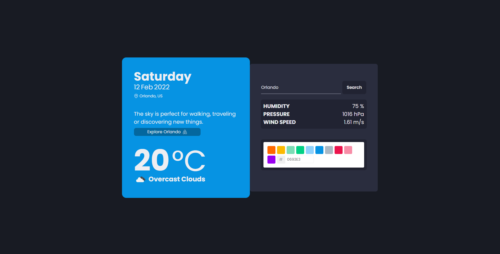
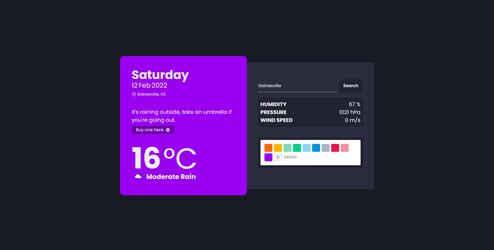

<h1>Umbrella Challenge</h1>

Em minha resolução, criei um projeto utilizando React que, ao receber o nome de um cidade pelo usuário, retorna valores de: 

<ul>
  <li>Temperatura;</li>
  <li>Pressão atmosférica;</li>
  <li>Humidade;</li>
  <li>Velocidade do vento.</li>
</ul>

<h1>Características</h1>

Como proposto no desafio, a aplicação deveria conter um elemento diferente baseado na condição climática atual do local inserido.   Assim, de acordo com o clima atual, um ícone diferente aparece (abaixo da temperatura) ilustrando a condição climática (também realiza mudança de cores diferenciando dia e noite).  Baseado também nas condições atuais, a aplicação apresenta algumas sugestões ao usuário. Em um dia de céu aberto e boas condições, por exemplo, mostra um link com opções de turismo e reacreação pela região da cidade inserida. Já em dias chuvosos, aconselha o uso de guarda chuvas e disponibiliza um link de compra com envio internacional.

Afim de tornar a aplicação mais interativa e demonstrar aprendizado com a linguagem, inseri uma paleta de cores responsável pela mudança do background do Box de informações.

<h1>Prints</h1>

